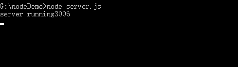
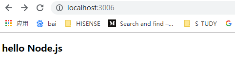

看了上一篇文章之后，相信大家对 node 有了了解，接下来我们来创建一个更加完整的 http server

##### 基本步骤

1、在本地指定端口启动一个 http server,等待客户端的请求

2、根据请求的 url,映射到静态文件的位置

3、检查文件是否存在

4、如果文件不存在，返回 404

5、如果文件存在，打开文件读取，根据文件类型设置响应头，发送文件到客户端

##### 搭建 http server

1、安装 node.js

2、创建一个空的文件夹 nodeDemo,并创建两个文件 server.js 和 mine.js ( 点击展开文件 )

<details>
<summary>server.js</summary>

```js
var port = "3006"
var DIR = "test1" //对应运行的文件夹名称
var http = require("http")
var url = require("url")
var fs = require("fs")
var mine = require("./mine.js")
var path = require("path")

var server = http.createServer(function(request, response) {
	// 浏览器访问 localhost:3006/index.html时，request.url为/index.html，即端口之后的部分
	var pathname = url.parse(request.url).pathname
	// 当访问的是根目录时，重定向到根目录下的index.html文件
	pathname = pathname == "/" ? "/index.html" : pathname
	var realPath = path.join(DIR, pathname)
	//文件后缀
	var ext = path.extname(realPath)
	ext = ext ? ext.slice(1) : "unknown"
	// 查找文件是否存在
	fs.exists(realPath, function(exists) {
		if (!exists) {
			response.writeHead(404, {
				"Content-Type": "text/html"
			})
			response.write(
				"<h3>404</h3>" +
					" this request URL" +
					pathname +
					" was NOT FOUND on this server"
			)
			response.end()
		} else {
			//文件夹存在时,读取文件,第一个参数为相对路径，比如 test1/index.html
			fs.readFile(realPath, "binary", function(err, file) {
				if (err) {
					response.writeHead(500, {
						"Content-Type": "text/plain"
					})
					// 此时服务报错，页面没启动，所以即使写了response.write也没用
					response.end(err)
				} else {
					// 申明文件类型
					var contentType = mine[ext] || "text/plain"
					response.writeHead(200, {
						"Content-Type": contentType
					})
					response.write(file, "binary")
					response.end()
				}
			})
		}
	})
})
server.listen(port)
console.log("server running" + port)
```

</details>

<details>
<summary>mine.js</summary>

```js
let types = {
	css: "text/css",
	less: "text/css",
	gif: "image/gif",
	html: "text/html",
	ico: "image/x-icon",
	jpeg: "image/jpeg",
	jpg: "image/jpeg",
	js: "text/javascript",
	json: "application/json",
	pdf: "application/pdf",
	png: "image/png",
	svg: "image/svg+xml",
	swf: "application/x-shockwave-flash",
	tiff: "image/tiff",
	txt: "text/plain",
	wav: "audio/x-wav",
	wma: "audio/x-ms-wma",
	wmv: "video/x-ms-wmv",
	xml: "text/xml"
}
module.exports = types
```

</details>
<font  size=2>注意：mine.js 文件的作用是根据文件后缀设置 http 响应头，即让浏览器根据不同的文档类型来解析，text/plain 是纯文本，text/html 是 html 格式</font>

3、在 nodeDemo 文件夹下新建一个 test1 的文件夹，文件夹内建立 index.html 文件


index.html 文件中 body 的内容

```html
<body>
	<h3>Hello Node.js</h3>
</body>
```

4、nodeDemo 下打开命令行，输入 node server.js,运行 server.js 文件



5、打开浏览器，输入地址 localhost:3006/index.html


至此服务创建成功，可以在 test1/index.html 内随意写自己的代码了，在浏览器手动刷新看结果

6、如果 test1 文件夹下有 a.html 和 imgs/1.jpg,如何查看呢，在浏览器修改路径即可,如 localhost:3006/imgs/1.jpg,总之浏览器路径和文件路径保持一致

7、如果 nodeDemo 文件夹下有 test2 文件夹需要运行，只需修改 server.js 文件内的路径 DIR 为 test2 即可
